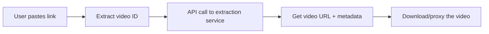

=== MEDIUM / DEV.TO ARTICLE ===

Title: "How TikTok Video Downloaders Actually Work (and How to Build One)"

---

## Introduction

With over 2 billion downloads and 1 billion monthly active users, TikTok dominates short-form video. But one persistent user need keeps surfacing: downloading videos without the TikTok watermark for reposting, archiving, or remixing.

I built Saveik (saveik.com) — a free, browser-based TikTok downloader available in 20 languages. Here's how these tools work under the hood, the technical challenges involved, and how you can build your own.

## How TikTok Serves Videos

When you watch a TikTok, the app requests the video from TikTok's CDN. The video URL is embedded in the page's HTML, but TikTok implements several anti-scraping measures:

1. **Dynamic token generation** — Video URLs include short-lived tokens
2. **User-Agent validation** — TikTok checks browser/client headers
3. **Rate limiting** — Aggressive IP-based throttling
4. **API changes** — Endpoints change frequently

Modern TikTok downloaders use RapidAPI or similar services to handle the extraction logic, as direct scraping is increasingly unreliable.

## Architecture of a TikTok Downloader



## Key Technical Decisions

### 1. Serverless vs. Traditional Backend
We chose Next.js on Vercel (serverless) because:
- Zero maintenance
- Global edge network
- Auto-scaling

### 2. API Integration
Using RapidAPI's TikTok downloader endpoints instead of building our own scraper:
- Avoids TikTok's anti-bot measures
- API provider handles maintenance
- Faster time to market

### 3. Multi-Language Support
We implemented dictionary-based i18n with Next.js App Router:
- Dynamic locale detection from Accept-Language headers
- Static generation for all 20 languages
- Automatic hreflang tags for SEO

```typescript
// Example: locale-aware routing
const locales = ['en', 'id', 'vi', 'th', 'es', 'pt-br', ...]
// Each locale has its own dictionary with full UI translations
```

## SEO & GEO Strategy

For a tool like this, SEO is critical. Our approach:
- **JSON-LD Schema**: Organization, WebApplication, HowTo, FAQPage, BreadcrumbList
- **Hreflang tags**: Properly configured for all 20 languages
- **Content silos**: Blog posts linking back to the main tool
- **llms.txt**: For AI engine discovery
- **Multi-language sitemap**: 87+ URLs across all locales

## Lessons Learned

1. **Don't build your own scraper** — APIs are more reliable
2. **SEO takes time** — Google Sandbox is real for new domains
3. **Multi-language is a differentiator** — Most competitors support 1-2 languages max
4. **Cloudflare can silently block crawlers** — Check your security settings

## Try It

Saveik is live at [saveik.com](https://www.saveik.com) — free, no registration, works on all devices.

---

**Tags:** #nextjs #react #tiktok #webdev #seo #typescript

---

📌 Post on:
1. Medium: https://medium.com/new-story
2. Dev.to: https://dev.to/new
3. Hashnode: https://hashnode.com/create
4. FreeCodeCamp News: https://www.freecodecamp.org/news/
